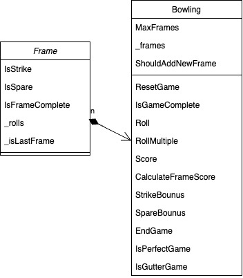

# Bowling Game Simulator

This project simulates a [ten-pin bowling](http://www.balmoralsoftware.com/bowling/bowling.htm) game according to traditional scoring rules. It's written in C# and demonstrates object-oriented programming principles, exception handling, and unit testing with NUnit.

## Features

- Simulate rolling in a ten-pin bowling game.
- Calculation of scores including strikes, spares, and open frames.
- Special handling for the 10th frame according to official bowling rules.
- Console output for each roll's result (strike, spare, open frame) and current score.
- Support for perfect games and gutter games with special end messages.
- Unit tests covering various game scenarios.
## UML Class Diagram


## Getting Started

### Prerequisites

- .NET 5.0 SDK or later
- NUnit 3 for unit testing

### Installation

Clone the repository to your local machine:
   ```bash
   git clone https://github.com/wenyuema-cs/BowlingGame.git
   ```

### Implement
Build the project and run the bowling game smulator
```
dotnet build
dotnet run --project BowlingGame
```

