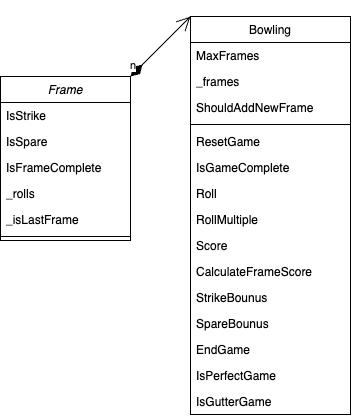
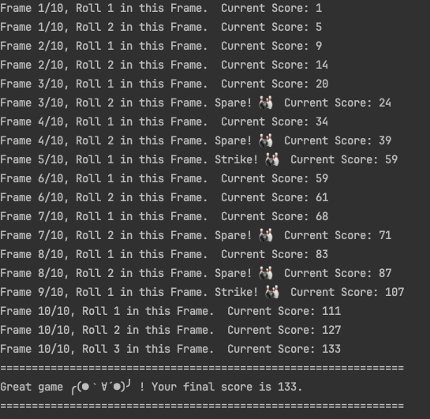
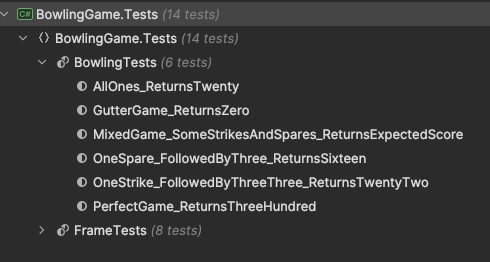
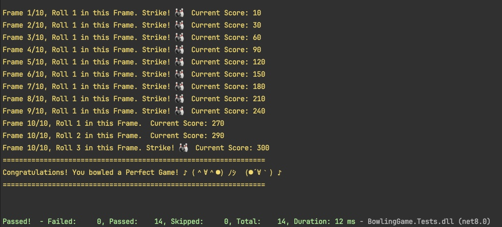

# Bowling Game Scoreboard

This project simulates a [ten-pin bowling](http://www.balmoralsoftware.com/bowling/bowling.htm) game according to traditional scoring rules. It's written in C# and demonstrates object-oriented programming principles, exception handling, and unit testing with NUnit.

## Features

- Simulate rolling in a ten-pin bowling game.
- Provide two gaming way 1) strike one after one 2)handling for the 10th frame all at once.
- Console output as scoreboard for each roll's result (strike, spare, open frame) and current score.
- Support for perfect games and gutter games with special end messages.
- Unit tests covering various game scenarios.

## UML Class Diagram


## Getting Started

### Prerequisites

- [.NET 8.0 SDK](https://dotnet.microsoft.com/en-us/download/dotnet/8.0) or later
- NUnit 3.13.3 
- NUnit.Analyzer 3.6.1
- NUnit3TestAdapter 4.2.1 for unit testing

### Installation

- Clone the repository to your local machine:
   ```bash
   git clone https://github.com/wenyuema-cs/BowlingGame.git
   ```

### Implement
- Build the project and run the bowling game smulator
```
dotnet build
dotnet run --project BowlingGame
```

- Output supposed to get




## Unit Test

### Catalog



### Terminal
- a perfect game as an example
```angular2html
dotnet test
```


